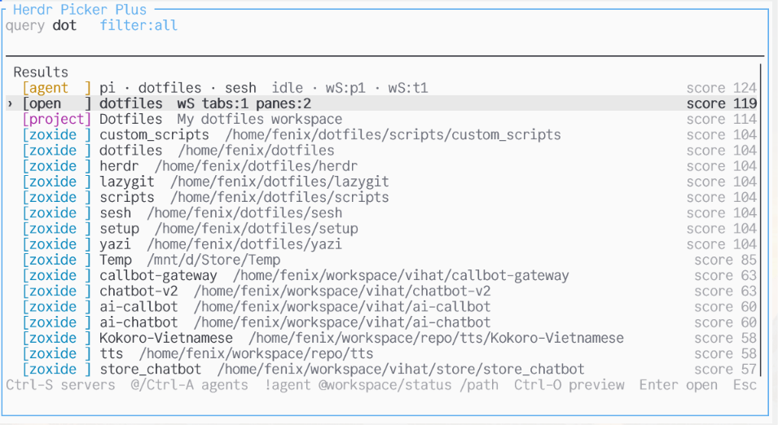

# Herdr Picker Plus

Herdr Picker Plus turns Herdr into a **command center for where you work next**.

Stop remembering whether something is an open workspace, a project template, a zoxide directory, an SSH host, or an agent pane. Hit one key, type what you remember, press Enter.

```text
Ctrl-T / prefix+t -> type -> Enter
```

Picker Plus is built for people who live in terminals all day:

- jump back to open workspaces instead of creating duplicates
- open project layouts with Herdr Plus tabs already wired up
- turn SSH hosts into local Herdr workspaces with a `remote` tab
- focus busy agent panes without hunting through tabs
- add your own tools with a tiny command/JSON contract

It feels like a fuzzy finder, but it acts like Herdr: it can focus, create, connect, launch, and reuse.



## Overview

### What makes it stand out

- **Picker center for Herdr**: one place to search workspaces, projects, directories, servers, agents, and actions.
- **Reuse-first workflow**: focuses matching open workspaces without confusing project and directory workspaces that share the same path.
- **Herdr Plus integration**: opens Herdr Plus project templates and can jump into Herdr Plus Quick Actions.
- **Workspace creation**: zoxide/root results can create a Herdr workspace directly.
- **Agent-aware**: agent panes appear as searchable entries and can be focused from the picker.
- **Fast server access**: `Ctrl-S` filters SSH/manual server entries and opens them in reuse-first Herdr workspaces.
- **Theme-aware**: maps supported Herdr themes locally and applies `[theme.custom]` overrides.
- **No external picker UI**: the TUI is built in Rust with `ratatui`; no `fzf`/`tv` runtime dependency.
- **Plugin integration contract**: other tools can appear in the picker with a simple command/JSON list-open API.

### Sources

| Source | Reads | Enter |
| --- | --- | --- |
| `workspace` | `herdr workspace list` + pane cwd | focus the exact selected workspace |
| `project` | Herdr Plus `projects/*.toml` | focus existing cwd or create workspace + project tabs |
| `server` | `~/.ssh/config` + `[servers]` config | create/focus server workspace + connect tab |
| `quick` | Herdr Plus Quick Actions | open Quick Actions picker |
| `zoxide` | `zoxide query -l` | focus existing cwd or create workspace |
| `root` | configured filesystem roots | focus existing cwd or create workspace |
| `agent` | agent panes from `herdr pane list` | focus agent pane |
| `plugin` | configured `[[integrations]]` commands | run configured open command |

### Fast server access

Server access stays as boring as SSH itself:

- reads hosts from `~/.ssh/config`
- allows optional `[[servers.entries]]` for aliases or explicit targets
- uses `Ctrl-S` to filter servers only; no extra query prefix
- creates/focuses a local `server: NAME` workspace, then runs `ssh TARGET` in its first tab

## Requirements

Required:

- Herdr `0.7.0` or newer

Required only when building from source:

- Rust stable
- Cargo

Optional integrations:

- `zoxide` for the `zoxide` source
- Herdr Plus for the `project` and `quick` sources

## Install

Choose one install path.

### Option A: install with Herdr

This is the easiest path for public installs:

```bash
herdr plugin install thanhdat77/herdr-picker-plus --yes
```

Verify Herdr sees the plugin:

```bash
herdr plugin list
herdr plugin action list --plugin herdr-picker-plus
```

### Option B: install from release archive

1. Download the archive for your platform from the GitHub Release page.
2. Extract it somewhere stable, for example:

   ```bash
   mkdir -p ~/.local/share/herdr/plugins
   tar -xzf herdr-picker-plus-linux-x86_64.tar.gz -C ~/.local/share/herdr/plugins
   ```

3. Link the extracted plugin directory:

   ```bash
   herdr plugin link ~/.local/share/herdr/plugins/herdr-picker-plus
   ```

### Option C: install from source

```bash
git clone https://github.com/thanhdat77/herdr-picker-plus.git
cd herdr-picker-plus
cargo build --release
herdr plugin link "$PWD"
```

## First run

Run the picker once without a keybinding:

```bash
herdr plugin action invoke herdr-picker-plus.open
```

If the overlay opens, installation is working.

## Add a keybinding

Add this to `~/.config/herdr/config.toml`:

```toml
[[keys.command]]
key = "prefix+t"
type = "plugin_action"
command = "herdr-picker-plus.open"
description = "picker center"
```

Reload Herdr:

```bash
herdr server reload-config
```

Now use:

```text
prefix+t
```

## Usage

| Key | Action |
| --- | --- |
| type | fuzzy search |
| `Enter` | open selected item |
| `Esc` / `Ctrl-C` | close |
| `Up` / `Down` | move selection |
| `Tab` | cycle source filters |
| `Ctrl-W` | workspaces only |
| `Ctrl-P` | Herdr Plus projects only |
| `Ctrl-Q` | Herdr Plus Quick Actions only |
| `Ctrl-Z` | zoxide only |
| `Ctrl-R` | roots only |
| `Ctrl-S` | servers only |
| `Ctrl-A` | agents only |
| `@` | same as `Ctrl-A`: show all agents, using configured agent sort |
| `!text` | match agent name, for example `!claude` |
| `@text` | agent-only match by workspace/session label/id or status, for example `@dotfiles` or `@idle` |
| `/text` | match cwd/path, for example `/chatbot` |
| `Ctrl-O` | toggle preview |
| `Ctrl-U` | clear query and filter |

## Configuration

Find the plugin config directory:

```bash
herdr plugin config-dir herdr-picker-plus
```

On first run, the plugin creates `config.toml` from [`examples/default-config.toml`](examples/default-config.toml).

### Default config

```toml
[picker]
reuse_existing = true
create_missing = true
engine = "nucleo" # nucleo | skim | simple
source_order = ["agent", "workspace", "project", "server", "zoxide", "root", "quick", "plugin"]
source_priority_boost = 25
agent_sort = "herdr" # herdr | priority | spaces

[sources]
open_workspaces = true
herdr_plus_projects = true
herdr_plus_quick_actions = true
zoxide = true
roots = true
agents = true
servers = true

[servers]
ssh_config = true

[theme]
inherit_herdr = true

[[roots]]
path = "~/workspace"
max_depth = 3

[[roots]]
path = "~/projects"
max_depth = 3

# Optional: add human aliases to agent panes.
[[agent_aliases]]
alias = "main ai dot"
agent = "claude"
workspace = "Dotfiles"
path = "dotfiles"
```

## Customize

### Choose sources

Disable sources you do not use:

```toml
[sources]
open_workspaces = true
herdr_plus_projects = false
herdr_plus_quick_actions = false
zoxide = true
roots = true
agents = true
servers = true
```

### Server access

Servers come from `~/.ssh/config` by default. Use `Ctrl-S` to show only servers, then type normally to search by name, host, user, tags, or target.

```toml
[servers]
ssh_config = true

[[servers.entries]]
name = "prod-api"
host = "10.0.0.5"
user = "ubuntu"
tags = ["prod", "api"]

[[servers.entries]]
name = "prod-shortcut"
target = "prod-api"
tags = ["prod"]
```

Selecting a server creates or focuses a local server workspace, then opens SSH in its first tab:

```text
workspace: server: NAME
tab: remote
cmd: ssh TARGET
```

For hosts read from `~/.ssh/config`, `TARGET` is the `Host` alias so your SSH config, ProxyJump, IdentityFile, and keepalive settings still apply.

### Agent search

Agent rows include the agent name, workspace/session label, cwd, status, pane id, tab id, and terminal id in search. The `@` shortcut and `Ctrl-A` use `picker.agent_sort`; default `herdr` reads Herdr's `agent_panel_sort`. Set `priority` for blocking first, done second, then the rest; set `spaces` to keep Herdr/pane order.

Useful queries:

```text
@                 # all agents, same as Ctrl-A
!claude @Dotfiles /dotfiles
!codex /chatbot
@idle
@wF
```

Add aliases when the real Herdr labels are not memorable enough:

```toml
[[agent_aliases]]
alias = "main ai dot"
agent = "claude"      # optional
workspace = "Dotfiles" # optional
path = "dotfiles"     # optional
```

All match fields are optional and use text-contains matching.

### Change source priority

Earlier sources get a ranking bonus and appear first on an empty query:

```toml
[picker]
source_order = ["agent", "workspace", "project", "server", "zoxide", "root", "quick", "plugin"]
source_priority_boost = 25
agent_sort = "herdr" # herdr | priority | spaces
```

Accepted names:

```text
agent, workspace, open, project, server, zoxide, root, quick, plugin
```

Set the boost to zero for pure matcher score:

```toml
source_priority_boost = 0
```

### Change search engine

```toml
[picker]
engine = "nucleo" # nucleo | skim | simple
```

| Engine | Use when |
| --- | --- |
| `nucleo` | default; fast, fzf-like ranking, good Unicode behavior |
| `skim` | compare against skim/fzf-style scoring |
| `simple` | tiny built-in ordered-character matcher for debugging |

### Add root directories

Use roots for broad directory scanning. Keep this list short; zoxide should cover frequent directories.

```toml
[[roots]]
path = "~/workspace"
max_depth = 3

[[roots]]
path = "~/projects"
max_depth = 2
```

A directory becomes a root result if it contains one of:

```text
.git
package.json
Cargo.toml
```

### Theme behavior

```toml
[theme]
inherit_herdr = true
```

When enabled, the picker:

1. reads `~/.config/herdr/config.toml`
2. maps supported `theme.name` values locally
3. applies `[theme.custom]` overrides last
4. falls back to One Light if Herdr config is unavailable

Supported built-in names:

```text
one-light, catppuccin, rose-pine, rose-pine-dawn, terminal
```

## Plugin integrations

Other tools can integrate without Rust code by exposing a list/open command pair. The `label` is shown as that integration's source name in the picker:

```toml
[[integrations]]
id = "bookmarks"
label = "Bookmarks"
enabled = true
collect = "bookmarks list --json"
open = "bookmarks open {{id}}"
notify_success = true
notify_error = true
```

`collect` prints JSON:

```json
[{"id":"abc","title":"Item","subtitle":"Info","path":"/tmp","kind":"bookmark"}]
```

When selected, Picker Plus runs `open` with `{{id}}`, `{{title}}`, `{{subtitle}}`, `{{path}}`, and `{{kind}}` shell-quoted. Success and failure are reported through Herdr notifications.

See [`docs/plugin-integrations.md`](docs/plugin-integrations.md).

## Herdr Plus integration

Herdr Plus is optional. If it is not installed, Picker Plus still works with workspaces, zoxide, roots, and agents.

When Herdr Plus is installed:

- `project` entries are loaded from:

  ```text
  ~/.config/herdr/plugins/config/cloudmanic.herdr-plus/projects/*.toml
  ```

- selecting a project:
  - focuses an existing `project:` workspace when the project path is already open
  - otherwise creates a new `project:` workspace
  - applies the project's tabs and startup commands

- `quick` opens the Herdr Plus Quick Actions picker.

## Debugging

List all candidates without opening the TUI:

```bash
./target/release/herdr-picker-plus list
```

Show plugin actions:

```bash
herdr plugin action list --plugin herdr-picker-plus
```

Show installed plugins:

```bash
herdr plugin list
```

Unlink local plugin:

```bash
herdr plugin unlink herdr-picker-plus
```

## Troubleshooting

### `prefix+t` does nothing

Check the keybinding command:

```bash
rg "herdr-picker-plus.open" ~/.config/herdr/config.toml
herdr server reload-config
```

Then verify the action exists:

```bash
herdr plugin action list --plugin herdr-picker-plus
```

### The old picker opens

You may still have an old plugin linked or an old keybinding command. Relink the current plugin:

```bash
herdr plugin link "$PWD"
herdr server reload-config
herdr plugin list
```

Make sure your keybinding uses:

```toml
command = "herdr-picker-plus.open"
```

### Project entries do not appear

Check Herdr Plus project files exist:

```bash
find ~/.config/herdr/plugins/config/cloudmanic.herdr-plus/projects -name '*.toml'
```

Also check config:

```toml
[sources]
herdr_plus_projects = true
```

### Zoxide entries do not appear

Check `zoxide` is installed and has data:

```bash
zoxide query -l
```

## Project docs

- [`docs/architecture.md`](docs/architecture.md): architecture and runtime flow
- [`docs/integrations.md`](docs/integrations.md): integration patterns for Herdr and other plugins
- [`docs/plugin-integrations.md`](docs/plugin-integrations.md): command/JSON integration contract
- [`RELEASE.md`](RELEASE.md): release process
- [`SECURITY.md`](SECURITY.md): security policy

## Design notes

Picker Plus is intentionally small and Herdr-native:

- **Reuse first**: if the matching workspace already exists, focus it instead of creating another one.
- **Source-aware identity**: a project workspace and a plain directory workspace can share the same cwd without stealing each other.
- **Servers stay boring**: server entries read `~/.ssh/config` and open `ssh TARGET` inside a local `server: NAME` workspace; no nested `herdr --remote`, no extra server-side config requirement.
- **Optional integrations**: Herdr Plus, zoxide, and command/JSON integrations are useful when present and quiet when missing.
- **Theme matching is pragmatic**: Herdr plugin v1 does not expose the active palette, so Picker Plus reads Herdr config and maps supported theme names locally, then applies `[theme.custom]` overrides.
- **UI follows plugin v1**: Herdr does not expose a native non-terminal custom UI API yet, so the action opens a managed overlay pane and the Rust TUI runs inside it.
