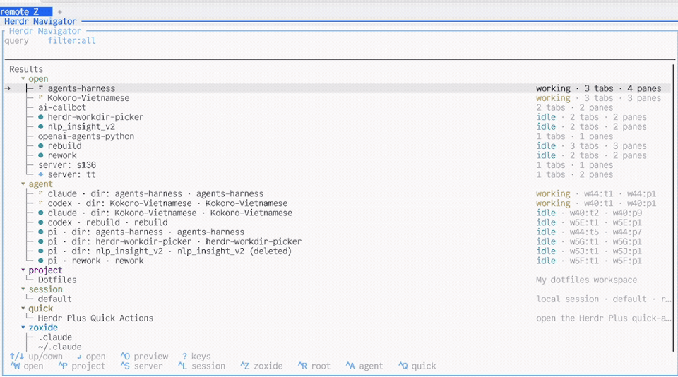

# Herdr Navigator

<p align="center">
  
</p>

<p align="center">
  <strong>One fuzzy navigator for every workspace, agent, project, session, remote, directory, and action in Herdr.</strong>
</p>

<p align="center">
  <a href="https://github.com/thanhdat77/herdr-navigator/actions/workflows/ci.yml"></a>
  <a href="LICENSE"></a>
  
  
</p>

Type what you remember. Navigator decides whether to **focus, create, attach, hand off, invoke, or run**—without making you remember which Herdr surface owns the destination.

```text
prefix+t  →  type  →  Enter
```

> [!IMPORTANT]
> **Upgrading from v0.3.1 or earlier?** Sorry for the one-time breaking rename. Starting with v0.3.2, the plugin ID, binary, config directory, and action prefix are all `herdr-navigator`. See the migration steps below.

## Install

```bash
herdr plugin install thanhdat77/herdr-navigator --ref v0.3.2 --yes
herdr plugin action invoke herdr-navigator.open
```

If the overlay opens, add a shortcut to `~/.config/herdr/config.toml`. Invoking `open` again focuses the existing Navigator in the current workspace instead of opening a duplicate:

```toml
[[keys.command]]
key = "prefix+t"
type = "plugin_action"
command = "herdr-navigator.open"
description = "jump to anything"
```

### Upgrade from v0.3.1 or earlier

Sorry for the migration. This completes the rename while the project is still young:

```bash
herdr plugin uninstall herdr-picker-plus
herdr plugin install thanhdat77/herdr-navigator --ref v0.3.2 --yes
herdr server reload-config
```

Replace `herdr-picker-plus` with `herdr-navigator` in your Herdr keybindings. Navigator copies your old plugin config and Jump Back state into the new config directory on first run; the old files are left untouched. Local development links should use `herdr plugin unlink herdr-picker-plus` instead of `uninstall`.

Reload Herdr, then press `prefix+t`:

```bash
herdr server reload-config
```

## See it in action

<p align="center">
  
</p>

*Source-aware rows keep live status, tabs, and panes aligned at a glance. [Watch the full 17-second demo.](https://github.com/thanhdat77/herdr-navigator/releases/download/v0.3.2/herdr-navigator-v0.3.2-demo.mp4)*

A single result list can move between live Herdr state and things that are not open yet:

- Type a repo name → focus its open workspace, or create one from a project, zoxide, or configured root.
- Type `@idle` or an agent alias → focus that agent pane.
- Filter remotes → hand off with Herdr's own `--remote TARGET --handoff` flow.
- Select an external integration → run its configured action.

## Why Navigator

| Capability | Why it matters |
| --- | --- |
| **One index across Herdr** | Search workspaces, agents, projects, sessions, remotes, directories, Quick Actions, and integrations together. |
| **Action-aware Enter** | Results do not just return paths; they focus, create, attach, hand off, invoke, or run. |
| **Reuse first** | Existing workspaces are focused before new ones are created. Project and directory workspaces sharing a cwd keep separate identities. |
| **Agents are first-class** | Search agent name, status, workspace, cwd, pane/tab/terminal IDs, session ID, and your own aliases. |
| **Extensible without Rust** | Add another tool with a command that returns JSON and a command that opens the selected item. |
| **No picker dependency** | The Rust/ratatui interface runs in a Herdr-managed pane; `fzf` and `tv` are not runtime requirements. |

Herdr's built-in navigation remains the simpler choice for a single entity type. Navigator is for the moment when “where next?” could mean a workspace, agent, path, session, remote, project, or action.

## What it can open

| Source | Data | Enter does |
| --- | --- | --- |
| `workspace` | `herdr workspace list` + pane cwd | Focus the exact workspace |
| `agent` | `herdr agent list` | Focus the agent pane |
| `project` | Herdr Plus project TOML | Reuse or create a project workspace and apply tabs and split panes |
| `session` | Herdr sessions + configured local entries | Attach the local session |
| `server` | Configured remote targets | Hand off to the remote Herdr server |
| `zoxide` | `zoxide query -l` | Reuse or create a directory workspace |
| `root` | Configured filesystem roots | Reuse or create a directory workspace |
| `quick` | Herdr Plus Quick Actions | Open the Quick Actions picker |
| `plugin` | Command/JSON integrations | Run the configured open command |

Every source can be disabled. Missing optional tools degrade quietly.

## Keyboard workflow

| Key | Action |
| --- | --- |
| type | Fuzzy search |
| `Enter` | Open selected item |
| `Up` / `Down` | Move selection |
| `Tab` | Cycle source filters |
| `Ctrl-W` | Workspaces |
| `Ctrl-A` / `@` | Agents, using configured status order |
| `Ctrl-P` | Herdr Plus projects |
| `Ctrl-Q` | Herdr Plus Quick Actions |
| `Ctrl-S` | Remotes |
| `Ctrl-L` | Sessions |
| `Ctrl-Z` | Zoxide |
| `Ctrl-R` | Roots |
| `Ctrl-X` | Close the open workspace matching the selected item |
| `Ctrl-B` | Mark or unmark the selected item |
| `Ctrl-O` | Toggle preview |
| `Ctrl-U` | Clear query and filter |
| `?` | Show active keybindings |
| `Esc` / `Ctrl-C` | Back or close |

Status glyphs follow Herdr's `prefix+g` visual language: `◉` blocked/attention, animated Braille spinner working, `●` idle, `✓` done, and `○` unknown. Diamond color priority is marked yellow, current accent/blue, then previous red. Selection uses `→`, and source trees use `▾`, `├─`, and `└─` markers.

On the initial unfiltered view, the previous workspace stays first, followed by marked items and then the normal source order.

Structured search narrows large result sets:

```text
!claude          # agent name
@idle            # agent workspace/status
@Dotfiles        # agent workspace label or id
/dotfiles        # cwd/path
```

Set `vim_mode = true` for normal-mode `j`/`k`, source keys, and `/` search. All source shortcuts can be remapped through `[picker.filter_keys]`.

## Power moves

### Close an open directory

Select an `open` or `agent` entry, or a `project`, `root`, or `zoxide` entry that matches an open workspace, then press `Ctrl-X`. Navigator closes that workspace and refreshes the list.

Navigator refuses to close the workspace that owns the picker; switch away first. Directories that are not open and server, session, quick-action, or plugin entries are left unchanged.

### Jump Back

Navigator remembers the workspace left by a successful local navigation. Bind the dedicated action for tmux-style current/previous toggling:

```toml
[[keys.command]]
key = "prefix+l"
type = "plugin_action"
command = "herdr-navigator.jump-back"
description = "jump to previous workspace"
```

The previous workspace can also stay pinned at the top of the initial picker view:

```toml
[jump_back]
# Record local workspace transitions and enable the action.
enabled = true
# Pin the previous workspace only while the picker is unfiltered.
pin_previous = true
```

If the previous workspace was closed, the next Jump Back clears the stale state and reports it.

### Persistent side pane

Keep Navigator beside your work:

```bash
herdr plugin action invoke herdr-navigator.open-side
```

The action opens the side pane, focuses it when it already exists, and closes it when invoked while focused. Unlike the overlay, the side pane stays open after `Enter`.

Optional binding:

```toml
[[keys.command]]
key = "prefix+shift+t"
type = "plugin_action"
command = "herdr-navigator.open-side"
description = "navigator side pane"
```

## Configuration

Navigator writes a fully commented config on first run:

```bash
herdr plugin config-dir herdr-navigator
```

See [`examples/default-config.toml`](examples/default-config.toml) for every option and its behavior. Common customizations:

```toml
[picker]
reuse_existing = true
create_missing = true
engine = "nucleo" # nucleo | skim | simple
source_order = ["workspace", "agent", "project", "session", "zoxide", "root", "server", "quick", "plugin"]
source_priority_boost = 5
agent_sort = "herdr" # herdr | priority | spaces
preview = true
detailed_rows = true # source-aware Herdr-style result rows
check_updates = true # daily background release check
vim_mode = false

[notifications]
enabled = true
audio = false # set true to enable sound
sound = "default" # default | custom
custom_sound = "" # Example: "~/sounds/navigator.wav"

[sources]
open_workspaces = true
agents = true
herdr_plus_projects = true
herdr_plus_quick_actions = true
sessions = true
servers = true
zoxide = true
roots = true

[[roots]]
path = "~/workspace"
max_depth = 3
```

Useful config surfaces:

- `picker.detailed_rows` enables source-aware rows: right-aligned metadata for most sources and a full-path second line only for zoxide/root.
- `picker.check_updates` checks GitHub releases in the background at most daily and shows `↑ vX.Y.Z available` in the header; failures stay silent.
- `[notifications]` can disable notifications entirely or use Herdr's default sounds, no sound, or a custom audio file.
- `[picker.filter_keys]` remaps source shortcuts.
- `[[agent_aliases]]` adds memorable search terms without renaming Herdr panes.
- `[sessions]` controls local sessions and manual remote targets.
- `[theme]` inherits supported Herdr themes and custom tokens.
- `[[integrations]]` adds external command/JSON sources.

## Add your own source

A tool only needs a list command and an open command:

```toml
[[integrations]]
id = "bookmarks"
label = "Bookmarks"
enabled = true
collect = "bookmarks list --json"
open = "bookmarks open {{id}}"
notify_success = true
notify_error = true
```

`collect` prints a JSON array:

```json
[{"id":"abc","title":"Item","subtitle":"Info","path":"/tmp","kind":"bookmark"}]
```

Navigator shell-quotes `{{id}}`, `{{title}}`, `{{subtitle}}`, `{{path}}`, and `{{kind}}` before running `open`. See [`docs/plugin-integrations.md`](docs/plugin-integrations.md) for the full contract.

## Requirements

- Herdr `0.7.3` or newer
- Linux or macOS
- Optional: `zoxide` for directory history
- Optional: Herdr Plus for project templates and Quick Actions
- Rust stable + Cargo only when building from source

Build and link locally:

```bash
git clone https://github.com/thanhdat77/herdr-navigator.git
cd herdr-navigator
cargo build --release
herdr plugin link "$PWD"
```

## Troubleshooting

Check that Herdr sees the plugin and its actions:

```bash
herdr plugin list
herdr plugin action list --plugin herdr-navigator
```

Inspect every collected candidate without opening the TUI:

```bash
./target/release/herdr-navigator list
```

If a keybinding does nothing, verify the action ID and reload config:

```bash
rg "herdr-navigator.open" ~/.config/herdr/config.toml
herdr server reload-config
```

Optional sources can be checked independently:

```bash
zoxide query -l
find ~/.config/herdr/plugins/config/cloudmanic.herdr-plus/projects -name '*.toml'
```

## Project docs

- [`docs/roadmap.md`](docs/roadmap.md) — roadmap and scope boundaries
- [`docs/architecture.md`](docs/architecture.md) — runtime flow and design
- [`docs/integrations.md`](docs/integrations.md) — Herdr/plugin integration patterns
- [`docs/plugin-integrations.md`](docs/plugin-integrations.md) — command/JSON contract
- [`CHANGELOG.md`](CHANGELOG.md) — released and unreleased changes
- [`CONTRIBUTING.md`](CONTRIBUTING.md) — development workflow

Herdr Navigator is intentionally small: reuse Herdr primitives, keep optional integrations optional, and make the common path `prefix+t → type → Enter`.
